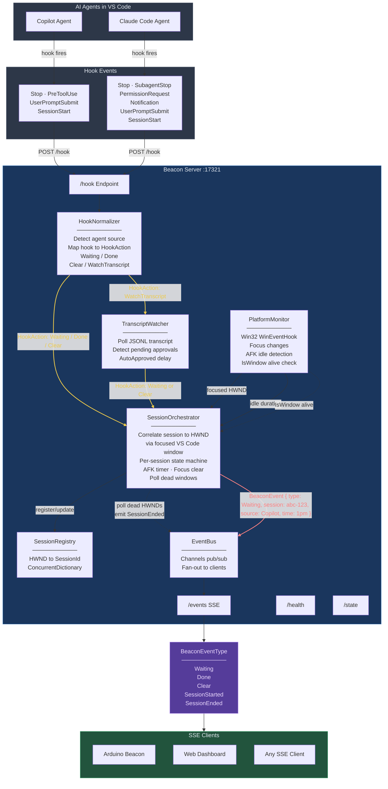

```mermaid
flowchart TB
    subgraph Agents["AI Agents in VS Code"]
        Copilot["Copilot Agent"]
        Claude["Claude Code Agent"]
    end

    subgraph Hooks["Hook Events"]
        CopHooks["Stop · PreToolUse<br/>UserPromptSubmit<br/>SessionStart"]
        ClaudeHooks["Stop · SubagentStop<br/>PermissionRequest<br/>Notification<br/>UserPromptSubmit<br/>SessionStart"]
    end

    Copilot -->|hook fires| CopHooks
    Claude -->|hook fires| ClaudeHooks

    CopHooks -->|POST /hook| Endpoint
    ClaudeHooks -->|POST /hook| Endpoint

    subgraph Server["Beacon Server :17321"]
        Endpoint["/hook Endpoint"]
        Normalizer["HookNormalizer<br/>───────────<br/>Detect agent source<br/>Map hook to HookAction<br/>Waiting / Done<br/>Clear / WatchTranscript"]
        Orchestrator["SessionOrchestrator<br/>───────────<br/>Correlate session to HWND<br/>via focused VS Code window<br/>Per-session state machine<br/>AFK timer · Focus clear<br/>Poll dead windows"]
        TW["TranscriptWatcher<br/>───────────<br/>Poll JSONL transcript<br/>Detect pending approvals<br/>AutoApproved delay"]
        Registry["SessionRegistry<br/>───────────<br/>HWND to SessionId<br/>ConcurrentDictionary"]
        Bus["EventBus<br/>───────────<br/>Channels pub/sub<br/>Fan-out to clients"]
        SSE["/events SSE"]
        Health["/health"]
        State["/state"]
        PM["PlatformMonitor<br/>───────────<br/>Win32 WinEventHook<br/>Focus changes<br/>AFK idle detection<br/>IsWindow alive check"]
    end

    Endpoint --> Normalizer

    Normalizer -->|HookAction: WatchTranscript| TW
    Normalizer -->|HookAction: Waiting / Done / Clear| Orchestrator

    TW -->|HookAction: Waiting or Clear| Orchestrator

    Orchestrator -->|register/update| Registry
    PM -->|focused HWND| Orchestrator
    PM -->|idle duration| Orchestrator
    PM -.->|IsWindow alive| Orchestrator
    Orchestrator -.->|poll dead HWNDs<br/>emit SessionEnded| Bus
    Orchestrator -->|"BeaconEvent { type: Waiting, session: abc-123, source: Copilot, time: 1pm }"| Bus
    Bus --> SSE

    subgraph Clients["SSE Clients"]
        direction TB
        Arduino["Arduino Beacon"]
        WebUI["Web Dashboard"]
        Other["Any SSE Client"]
    end

    WireTypes["BeaconEventType<br/>───────────<br/>Waiting<br/>Done<br/>Clear<br/>SessionStarted<br/>SessionEnded"]
    SSE --> WireTypes --> Clients

    style Agents fill:#2d3748,stroke:#4a5568,color:#e2e8f0
    style Hooks fill:#2d3748,stroke:#4a5568,color:#e2e8f0
    style Server fill:#1a365d,stroke:#2b6cb0,color:#e2e8f0
    style Clients fill:#22543d,stroke:#38a169,color:#e2e8f0
    linkStyle 5,6,7 stroke:#ecc94b,stroke-width:2px,color:#ecc94b
    linkStyle 13 stroke:#fc8181,stroke-width:2px,color:#fc8181
    style WireTypes fill:#553c9a,stroke:#b794f4,color:#e9d8fd
```
